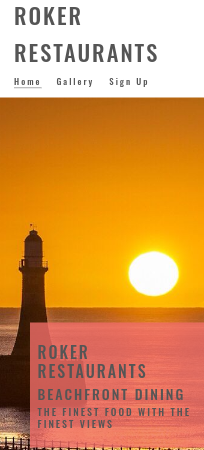
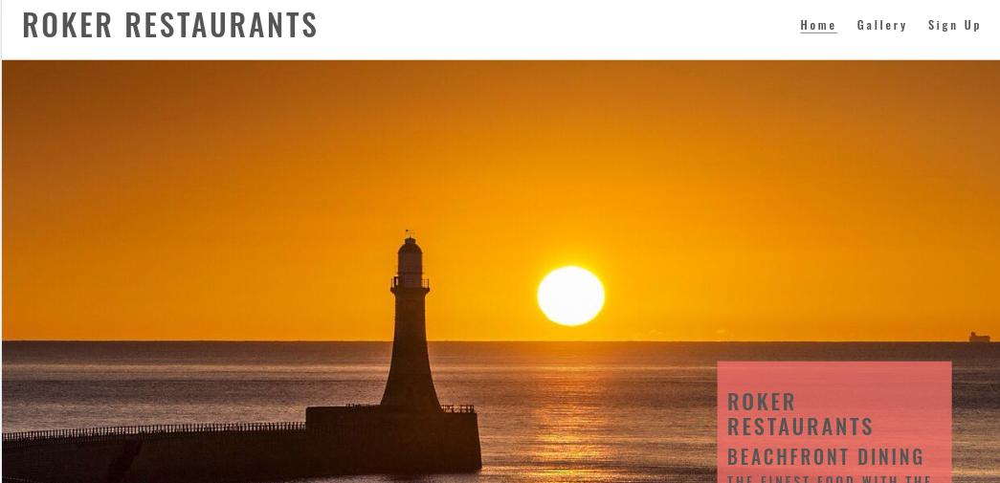
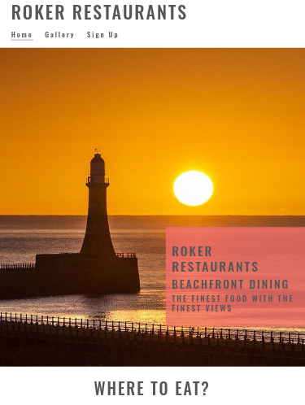
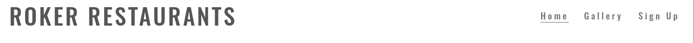
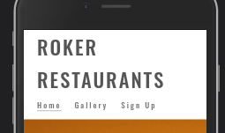
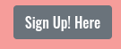
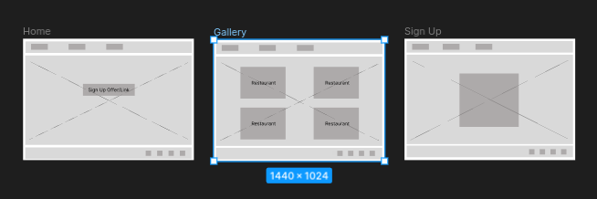
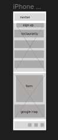

# Roker Restaurants

## Milestone Project 1 - Static Frontend Website

<h2 align="left"></h2> 
<h2 align="left"></h2>
<h2 align="left"></h2>

* Roker Restaurants is a website designed to entice new customers to the varying restaurants located on Roker beach near Sunderland.

* This is my Milestone 1 Project submission for Code Institute's Diploma in Web Application Development. My website will consist of 3 pages and is built using technologies and languages I have learned so far on the course, mainly HTML and CSS.

## Live Project

[View the live project here.](https://brianmcananey.github.io/milestone-1-project/)

## Repository

[Find the github repository here](https://github.com/brianmcananey/milestone-1-project)

# Table of Contents

## Contents
- [Roker Restaurants](#roker-restaurants)
  - [Milestone Project 1 - Static Frontend Website](#milestone-project-1---static-frontend-website)
  - [Live Project](#live-project)
  - [Repository](#repository)
- [Table of Contents](#table-of-contents)
  - [Contents](#contents)
- [User Experience](#user-experience)
  - [User Stories](#user-stories)
    - [Prospective Visitors](#prospective-visitors)
    - [Business Owners](#business-owners)
  - [Design](#design)
  - [Colour Scheme](#colour-scheme)
    - [Typography](#typography)
    - [Imagery](#imagery)
    - [Icons](#icons)
  - [Structure](#structure)
    - [Information Architecture](#information-architecture)
    - [Navigation Bar](#navigation-bar)
    - [Buttons](#buttons)
    - [Footer](#footer)
  - [Wireframes](#wireframes)
- [Features](#features)
  - [Current Features](#current-features)
    - [Responsive on all device sizes](#responsive-on-all-device-sizes)
    - [Interactive elements](#interactive-elements)
  - [Future Features](#future-features)
    - [Events](#events)
    - [Past/Upcoming Events](#pastupcoming-events)
    - [E-Commerce](#e-commerce)
    - [Expansion](#expansion)
- [Technologies Used](#technologies-used)
  - [Languages Used](#languages-used)
  - [Frameworks Libraries and Programs](#frameworks-libraries-and-programs)
- [Testing](#testing)
- [Deployment](#deployment)
  - [GitHub Pages](#github-pages)
  - [Forking the GitHub Repository](#forking-the-github-repository)
  - [Making a Local Clone](#making-a-local-clone)
- [Credits](#credits)
  - [Code](#code)
  - [Content](#content)
  - [Media](#media)
  - [Acknowledgements](#acknowledgements)


# User Experience

## User Stories

### Prospective Visitors

*These are users who are considering or have already planned a trip to one of the restaurants*

 * As a prospective visitor I would like to see what deals are on offer in each restaurant.
 * As a prospective visitor I would like to see what variety of food is on offer in each of the restaurants.
 * As a prospective visitor I would like to see what amenities are nearby to the restaurants.
 * As a prospective visitor I would like to be able to contact each restaurant to make reservations.

### Business Owners

*These are the owners of the restaurants*

 * As a business owner, I want the website to entice new customers into the restaurants.
 * As a business owner, I want the website to be user-friendly and easy to navigate on any device.
 * As a business owner, I want the website to encourage regular visits to the restaurants.
 * As a business owner, I want the website to encourage visits to my own website to drive sales.

## Design

## Colour Scheme

<h2 align="left">#555555</h2>
<h2 align="left">#ffffff</h2>
<h2 align="left">rgb(241,110,105)</h2>

I have chosen these colours as I think they give a good contrast to each other. The grey #555555 will be used for the font with the white #ffffff as the background. The purple rgb(241,110,105) wil be used as a back-ground colour for a text box over the top of the hero image.

### Typography

I have chose the "Oswald" font as I believe it suits the layout of the website and simple style the website is going for. The back-up font is san-serif.

### Imagery

* Imagery is very important to the website as the site needs to show off the area the restaurants are in and be appealing for people to come and visit.

* The pages will be consistent with the same large hero image displayed over the contents of 2 pages. They will also have the same navbar and footer.

### Icons

* I used icons from Font Awesome to encourage users to click on certain buttons and to add a clear visual indicator of where to click.

## Structure

### Information Architecture

* I used a similar layout to the Love Running example in the Code Institute course as I believed it would suit the layout of my hero image and website as a whole, to fit in a page for the gallery and sign up page. The website has a Homepage, then 2 further pages; a Gallery page and a Sign Up page.
  - Homepage - Large hero image showing a view of the area. It will also show a selection of restuarants in the area with direct links to their own websites which open in seperate tabs. It will also have a section showing what is on in the area and when.
  - Gallery Page - This will show images of different sights of the area, for example, views from the restaurants, local wildlife and upcoming events.
  - Sign Up - Same large hero image as the homepage but will also have a form on to sign up to a newsletter/discount codes.
* Most pages feature buttons with 'call to actions' and internal links where appropriate, quickly directing them to relevant information on another page. This saves repeating information, and helps keep the website clean and concise.

### Navigation Bar

* Each page will have the navbar along the top, allowing the user to easily navigate to the different pages. The navbar appears as a horizontal list on desktop, while on mobile the logo/title is above a horizontal navbar list.
* I have also added an underline to the "active" page and when you hover over the other pages.

<h2 align="center"></h2>
<h2 align="center"></h2>


### Buttons

* Buttons change colour when hovered over. The button text is legible both in its normal and hover state.
* I have used Bootstrap Button classes.
  <h2 align="center"></h2>

### Footer

* The Footer includes the social media links for the website.
* Social media links open in a new page.
* The Footer remains consistent on all pages.

<h2 align="center"></h2>

## Wireframes

  <h2 align="center"></h2>
<h2 align="center"></h2>

# Features

## Current Features

### Responsive on all device sizes

* By using mobile first design I have created a website that is fully responsive on all screen sizes.
* I have used the Bootstrap grid system and Flex classes to adjust the layout based on the device screen size. This allows the images and texts to look good and be easy to read.

### Interactive elements

* When you hover over the restaurant names they change colour and become underlined, encouraging users to click on them.
* CSS transitions have been used on the navbar, buttons and social media icons.

## Future Features

### Events

* There is an events section with times and days, allowing users to see what is on and when. In future this could be expanded into a full page listing times, dates and upcoming events.

### Past/Upcoming Events

* There could be an archive of past or upcoming events.

### E-Commerce

* There could be an online booking service, allowing users to book directly through the site instead of being redirected to the others.

### Expansion

* The website could evolve from just advitising restuarants to other activities and businesses in the area. From sport, to wildlife excursions and live music.  

# Technologies Used

## Languages Used

* [HTML5](https://en.wikipedia.org/wiki/HTML5)

* [CSS3](https://en.wikipedia.org/wiki/CSS)

## Frameworks Libraries and Programs

- [Bootstrap 4](https://getbootstrap.com/) 
  - I used bootstrap throughout the site to make it responsive. The website uses Bootstrap's Containers, Grid System and Flexbox and Button classes. I sourced code from the Bootstrap documentation when building the Navbar, Carousel, Buttons and Contact Form, 
  
- [Google Fonts](https://fonts.google.com/)
  - The fonts were imported from google fonts. I have used Oswald for the website with sans-serif as the back-up .
  
- [Font awesome](https://fontawesome.com/)
  - I used icons from font awesome to visually distinguish sections of the text and next to links.

- [Git](https://git-scm.com/)
  - Git was used as a version control in the terminal.

- [Github](https://github.com/)
  - Github was used to create and store the project repository.

- [jQuery](https://jquery.com/)
  - jQuery came with Bootstrap to make the navbar responsive.

- [Figma](https://figma.com/)
  - Figma was used to create Wireframes for the project during the initial planning stage.

- [Adobe Photoshop](https://www.adobe.com/ie/products/photoshop.html)
  - Photoshop was used to resize and edit images for the website.

- [Google Chrome Dev Tools](https://developer.chrome.com/docs/devtools/)
  - Google Chrome's Dev Tools were used while building the project to test responsiveness and for debugging.

- [Google Images](https://www.googleimages.com/)
  - Google Images was used to source imagery for the website.

# Testing
- Please refer [here](TESTING.md) for more information on testing of the Row Gallery website.

# Deployment

## GitHub Pages

The project was deployed to GitHub Pages using these steps:

1. Log in to GitHub and go to the [GitHub Repository](https://https://github.com/brianmcananey/milestone-1-project)
2. Locate the Navbar at the top of the Repository (not top of page). Click the Settings tab.
3. Locate the Navbar on the left hand side of the page. Click the "Pages" section (under 'Code and automation').
4. Under "Source", click the dropdown called "None" and select "main". Click save.
5. The page will automatically refresh.
6. A notification will appear at the top of the page with the [link](https://) to the deployed site. You can return to this GitHub Pages section to access the link.

## Forking the GitHub Repository

Forks are used to propose changes to someone else's project or to use someone else's project as a starting point for your own idea. By forking the GitHub Repository you make a copy of the original repository on our GitHub account to view and/or make changes without affecting the original repository.

To Fork a Github Repository:

1. Log in to GitHub and go to the [GitHub Repository](https://)
2. Locate the Fork button in the top-right corner of the page, click Fork.
3. You should now have a copy of the original repository in your GitHub account.

## Making a Local Clone

You will now have a fork of the repository, but you don't have the files in that repository locally on your computer.

To make a local clone:

1. Log in to GitHub and go to the [GitHub Repository](https://)
2. Above the list of files, click  Code.
3. To clone the repository using HTTPS, under "Clone with HTTPS", click the 'Copy' icon. To clone the repository using an SSH key, including a certificate issued by your organization's SSH certificate authority, click Use SSH, then click the 'Copy' icon. To clone a repository using GitHub CLI, click Use GitHub CLI, then click the 'Copy' icon.
4. Open Git Bash.
5. Change the current working directory to the location where you want the cloned directory.
6. Type git clone, and then paste the URL you copied earlier. It will look like this, with your GitHub AE username instead of YOUR-USERNAME:

```
$ git clone https://github.com/YOUR-USERNAME/YOUR-REPOSITORY
```

7. Press Enter. Your local clone will be created.

```
$ git clone https://github.com/YOUR-USERNAME/YOUR-REPOSITORY
> Cloning into `milestone-project-one`...
> remote: Counting objects: 10, done.
> remote: Compressing objects: 100% (8/8), done.
> remove: Total 10 (delta 1), reused 10 (delta 1)
> Unpacking objects: 100% (10/10), done.
```

Click [Here](https://docs.github.com/en/github-ae@latest/get-started/quickstart/fork-a-repo) for the GitHub quick start guide with images and more detailed explanations of the above process.

# Credits

## Code

-   [Bootstrap4](https://getbootstrap.com/docs/4.4/getting-started/introduction/): Bootstrap Library was used throughout the project mainly to make site responsive using the Bootstrap Grid System and Flexbox.

-   [Code Institute](https://codeinstitute.net/): I referred to lessons and source code from Code Institute's Web Application Development course. I referred to the Love Running project for the design.

## Content

-   I wrote all the content for the website. The restaurants and photographs are all real but placed in a ficticious setting for my milestone project website.
  
- I referred to the [GitHub Documenation](https://docs.github.com/en/github-ae@latest/get-started/quickstart/fork-a-repo) for the basis of the Deployment section of this README file. I also referred to [Code Institute's Sample README](https://github.com/Code-Institute-Solutions/SampleREADME/blob/master/README.md) for the general structure of this README file.

## Media

-   All Images were sourced from open source websites [Google Images](https://www.googleimages.com/) With special thanks to: 
- [Tin of Sardines](https://www.tinofsardines.co.uk)
- [North] (https://dishcult.com)
- [Six Pier Point](https://www.instagram.com/sixpierpoint/)
- [Fausto](https://www.instagram.com/fausto.coffee/)

## Acknowledgements

- Thank you to my Mentor Rohit Sharma for helpful feedback, industry insights and recommended tools.

- Thank you to the City of Bristol College for their encouragement and technical support - with special mention to Pasquale Fasulo for his continuous support.

- Thank you to the tutors and staff at Code Institute for their support.

Roker Restaurants is fictitious. This website is purely for the sake of the developer's portfolio and not for public consumption.

Brian McAnaney, 2023.
