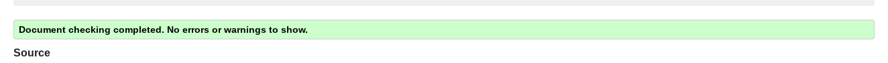
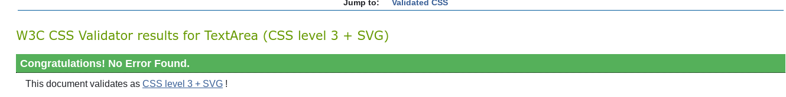
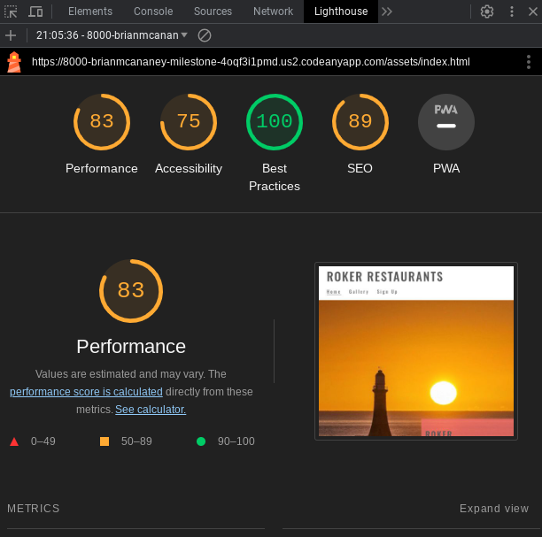
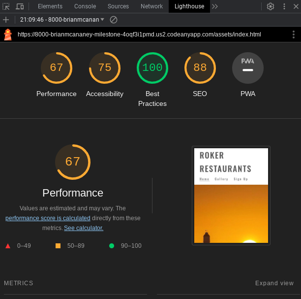
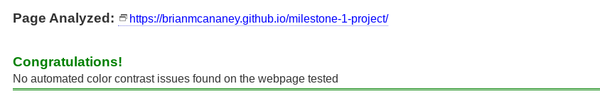
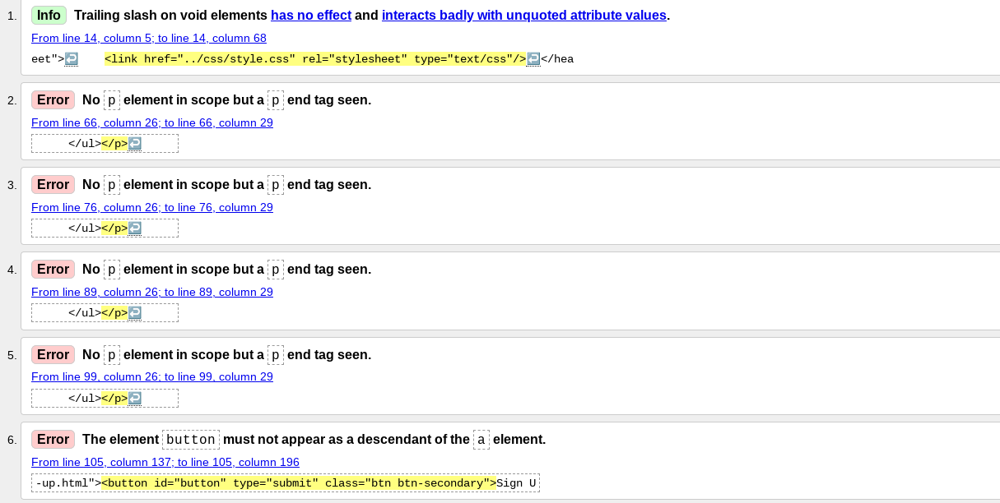
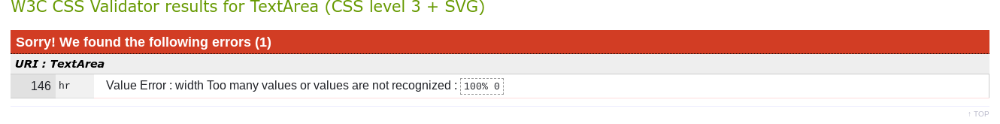

# Testing

The Roker Restaurants website has been tested using the following methods:
- [Testing](#testing)
- [Code Validation](#code-validation)
  - [W3C HTML Validator](#w3c-html-validator)
    - [Home Page](#home-page)
    - [Gallery Page](#gallery-page)
    - [Sign Up Page](#sign-up-page)
  - [W3C CSS Validator](#w3c-css-validator)
- [Lighthouse](#lighthouse)
    - [Lighthouse Report for Homepage (Desktop)](#lighthouse-report-for-homepage-desktop)
    - [Lighthouse Report for Homepage (Mobile)](#lighthouse-report-for-homepage-mobile)
- [A11y Color Contrast Accessibility Checker](#a11y-color-contrast-accessibility-checker)
- [Browser Compatibility](#browser-compatibility)
- [Responsiveness](#responsiveness)
- [Testing User Stories](#testing-user-stories)
  - [Prospective Visitors](#prospective-visitors)
  - [Business Owners](#business-owners)
- [Peer Review](#peer-review)
- [Bugs](#bugs)
  - [Resolved](#resolved)
  - [Unresolved](#unresolved)

# Code Validation

## W3C HTML Validator

The Roker Restaurants website passed all tests using the W3C HTML Validator tool

### Home Page
<h2 align="center"></h2>

### Gallery Page
<h2 align="center"></h2>

### Sign Up Page
<h2 align="center"></h2>

## W3C CSS Validator

The Roker Restaurant website passed all tests using the W3C CSS Validator tool
<h2 align="center"></h2>

# Lighthouse

### Lighthouse Report for Homepage (Desktop)
<h2 align="center"></h2>

### Lighthouse Report for Homepage (Mobile)
<h2 align="center"></h2>

I used the Lighthouse reports in Google Developer Tools to examine the pages of the website for the following
- Performace
- Accessibility
- Best Practices 
- SEO

All Pages performed above average (scored 81 and above) in:
- Performance, Accessibility, Best Practices and SEO on Desktop
- Accessibility, Best Practices and SEO on Mobile

Some Pages did not perform as well (scored 62 and above) in:
- Performance on mobile

Lighthouse recommends saving images in next-gen formats and eliminating render-blocking resources to improve performance on mobile. (Detailed in [Unresolved Bugs](#unresolved) section)

# A11y Color Contrast Accessibility Checker

All website pages were tested using the A11y Color Contrast Accessibility Checker and no automated colour contrast issues were found.

<h2 align="center"></h2>

# Browser Compatibility

The site was tested in Google Chrome, Microsoft Edge and Mozilla Firefox on desktop.

The site was tested in Google Chrome and Safari on mobile and tablet.

No issues arose during browser testing. CSS transitions worked on all browsers tested. 

The font was a little bit hard to see on some devices so i changed the font colour from #777777 to #555555.

# Responsiveness

Responsivity tests were carried out using Google Chrome DevTools. Device screen sizes covered include:
- iPhone SE
- iPhone 12 Pro
- Samsung Galaxy S20 Ultra
- iPad Air
- Surface Pro 7
- Surface Duo
- Samsung Galaxy A51/71

I also personally tested the website on Samsung Galaxy S22, Samsung Chrome book, Dell XPS 15 laptop and a Dell widescreen monitor.

# Testing User Stories

## Prospective Visitors

- As a prospective visitor I would like to see what is currently on offer at the restaurants.

    * On the Homepage there is a section which shows events on during the week.
    - There is also a link to each restaurant own webpage where they can go into further detail.
    - On the Homepage page there are the names, descriptions and dates of latest events.

## Business Owners
     
* As the business owner, I want my website to be accessible and user-friendly on any device.

    - The website design is responsive so remains aesthetically pleasing and functional on all screen sizes. It features semantic HTML tags, screen reader tags and aria tags for accessibility. The pages also feature meta descriptions and alt-text which is beneficial for SEO.

- As a business owner, I want the website to encourage visits to my own website to drive sales.

    - There are links to social media channels in the footer bar, which appears on every page. Also links to each individual website on the homepage.

# Peer Review

I asked a number of friends both inside and outside of the Code Institute community for feedback on my project. The feedback on the website and documentation was positive.

It was suggested that I could add additional events/companies onto the page, for example, advertising sports or wildlife excursion. I decided not to add these as it felt like too late in the project, but I did add it into my README.md as a possible future features.

# Bugs

## Resolved

- The font color was too light so I changed it from #777777 to #555555.
- I forgot to input a language into the header so changed that by entering English into it (lang="en")
- The images on the gallery page wouldnt sit properly on mobile devices so I had to change the column count on the page to make them sit better on the device to make the page more appealing to users.
- When running the W3C Validator it came up with errors which have now been fixed.

<h2 align="center"></h2>

- When running the CSS Validator it came up with this error, which has now been fixed.

<h2 align="center"></h2>

## Unresolved

- Improve Lighthouse Performance score on mobile by making changes including:
    - Serve images in next-gen formats (Image formats like WebP and AVIF often provide better compression than PNG or JPEG, which means faster downloads and less data consumption.)
    

Back to [README.md](/README.md#testing)